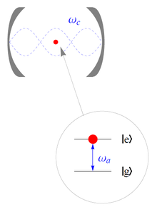

# Jaynes-Cumming Model

## Introduction
The Jaynes-Cumming model is the simplest possible model of quantum mechanical light-matter interaction, describing a single two-level atom interacting with a single electromagnetic cavity mode. 

## Model
The Hamiltonian for this system is (in dipole interaction form)
$$H = \hbar \omega_c a^\dagger a + \frac{1}{2} \hbar \omega_a \sigma_z + \hbar g (a^\dagger + a)(\sigma_- + \sigma_+)$$

Under rotating-wave approiximation,
$$H_{RWA} = \hbar \omega_c a^\dagger a + \frac{1}{2} \hbar \omega_a \sigma_z + \hbar g (a^\dagger \sigma_- + a\sigma_+)$$

where $\omega_c$ and $\omega_a$ are the frequencies of the cavity and the atom, g is the interaction strength

## Refrences
https://nbviewer.org/urls/qutip.org/qutip-tutorials/tutorials-v4/lectures/Lecture-1-Jaynes-Cumming-model.ipynb